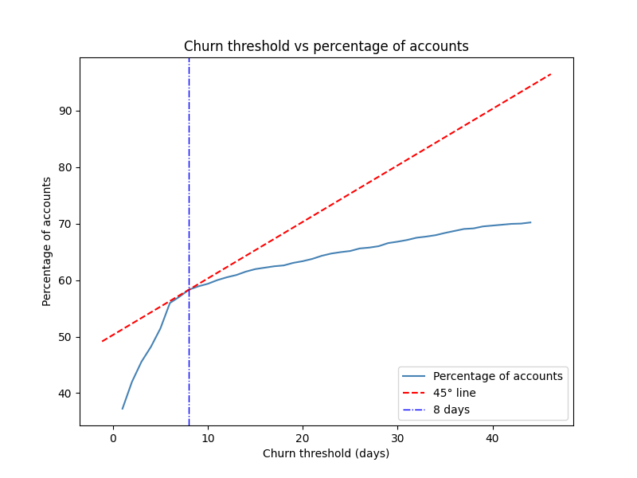

# Churn prediction PoC

## How did you choose to define churn and why?
The churn threshold (in days) vs percentage of accounts affected are shown on a chart, that shows that the accounts affected rises quickly for small thresholds, then starts to flatten after ~8–10 days. The tangential point is at 8 days ("elbow point"), before that increasing the threshold gives more coverage quickly and after the 8 days' threshold gains slow down significantly. 8 days is a reasonable balance point.

## What model have you built to predict it, and why did you choose this model?
Once the churn threshold is set to 8 days, I have prepared 2 different versions of training sets:
- __Outlier cutoff precision of 6__ = one where values between quantiles of 0.000001 and 0.999999 are kept
- __Outlier cutoff precision of 4__ = one where values between quantiles of 0.0001 and 0.9999 are kept

Then I have prepared several different models, including:
- __decision tree__: good for a quick baseline and easy to interpret, but prone to overfitting
- __random forest__: can handle even non-linear relationships, since it is decision trees trained on different subsets of the data, it can also overfit
- __gradient boosting__: good for imbalanced binary classification
- __gradient boosting (tuned)__: ran a parameter tuning with Optuna and trained the model with the best parameters
- __dense neural network__: requires a huge amount of data, difficult to interpret

| Churn threshold | Outlier cutoff precision (decimal points) | Model | Train F1 score | Train ROC AuC | Train PR AuC | Test F1 score | Test ROC AuC | Test PR AuC |
|---:|---:|---:|---:|---:|---:|---:|---:|---:|
| 8 days | 6 | Decision Tree | 0.7601 | 0.7532 | 0.8273 | 0.7237 | 0.6484 | 0.8511 | 
| 8 days | 6 | Random Forest | 1.0000 | 1.0000 | 1.0000 | 0.7185 | 0.6466 | 0.8498 |
| 8 days | 6 | Gredient Boosting | 0.8789 | 0.8631 | 0.9010 | 0.6393 | 0.6539 | 0.8515 |
| 8 days | 6 | Gredient Boosting (tuned) | - | 0.8512 | 0.8577 | - | 0.71316 | 0.8223 |
| 8 days | 6 | Dense neural network | 0.6658 | 0.6170 | 0.7436 | 0.7289 | 0.5903 | 0.8324 |
| 8 days | 4 | Decision Tree | 0.7599 | 0.7524 | 0.8266 | 0.7226 | 0.6549 | 0.8536 |
| 8 days | 4 | Random Forest | 1.0000 | 1.0000 | 1.0000 | 0.7163 | 0.6304 | 0.8432 |
| 8 days | 4 | Gredient Boosting | 0.8755 | 0.8593 | 0.8984 | 0.6345 | 0.6569 | 0.8538 |
| 8 days | 4 | __Gredient Boosting (tuned)__ | - | 0.8558 | 0.8583 | - | 0.7186 | 0.8267 |
| 8 days | 4 | Dense neural network | 0.7004 | 0.6290 | 0.7636 | 0.7605 | 0.5955 | 0.8411 |

I have chosen the __gradient boosting (tuned)__ with stronger outlier filtering as solution because of its simplicity (scikit-learn) and reasonable ROC AuC and PR AuC metrics on both training and test set.

## What is the appropriate way to measure model performance in this context? And how does it perform against this?
The models' performance should not be measure only by generic accuracy, I would suggest using:
- __Precision-Recall AuC__: because churning is supposedly imbalanced, PR AuC focuses on minority class, captures trade-off between catching churners and avoiding false positives
- Also showing __ROC AuC__ and __F1 score__: to have a better understanding on the performance of the models

The out-of-the-box and the tuned versions of gradient boosting models perform well when trained on the training set with heavier outlier filtering, the tuned version has higher value for test ROC AuC and bit lower test PR AuC.

## What assumptions have you made to build the model?
- I used customers where __registration date__ = 2021 for training set and __registration date__ = 2022 for test set. The __registration date__ variable has a huge spike around October 2021. There might have been a campaign during which a lots of customers assigned then churned, this could somewhat spoil the training set
- I have chosen the columns containing currencies in GBP, as I assume they are correctly converted from foreign currency. Also ignored inflation.
- Ignored __stl_betting_duty__, __stl_licence_fee__, __stl_tax__ and __stl_partnerfee__ as they are all zeros and most probably calculated fields.
- When gruped the data by __accountid__, __summary_date__, __bet_type__, __category__, __secondary_product__, __foundation_category__, __account_tier__, __activity_channel__, and __product_group__ the output table contains no duplicate records. This indicates that the dataset is maintained at a daily level of granularity, with records uniquely defined by the combination of these dimensions.
- The table of churn thresholds (1 - 45 days) vs percentage of churned accounts affected (users who never returned (considering until the date of the last activity only)). __8 days__ for the churn threshold seems to be a reasonable as anything less than this might be disturbing for the customers.

## What features did you build/use?
During the feature engineering section, I have created only a handful of new features:
- __time_to_first_deposit_age__: number of days between registration and first money deposit
- _min_, _mean_, _median_, _max_, _nunique_ of all the numerical features

As this is only a PoC, I haven't invested much time in this. For production a wide range of engineered features should be prepared and tested.

## And which features/data would you have liked to have had?
- A labelled and validated dataset :)

Some ideas:
- Behavioural
    - __time_to_bonus_claim__: number of days between registration and bonus claim
    - __time_to_first_withdrawal__: number of days between registration and withdrawal
    - __number_of_sessions_before_claiming_bonus__: number of browser sessions before claiming bonus
- Account related
    - accounts created per IP per hour/day
    - IP - country mismatch

## What are the next steps to put this model into an operational production deployment?
Build a wrapper class and API backend around it, then create a Docker container, test it and upload it to a service provider (e.g.: AWS SageMaker), then call it. 

Unfortunately serverless is most probably not an option since data science packages are huge and on AWS there is a strict 250MB limit for Lambdas. Lambdas would be cheaper as it is billed after running the script only, but it has a cold start problem, that might be a problem.

# Usage
`source .venv/bin/activate` 
`python inference.py --model_path=output/gradient_boosting_churn_model_20260610.pkl --csv_path=output/training_set_aggregated.csv --output_path=result.csv`
Where
- __model_path__ is the path to model
- __csv_path__ is the path to input CSV
- __output_path__ is the name of the output file